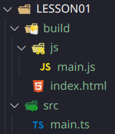

src: 
- https://courses.davegray.codes/view/courses/web-dev-roadmap-for-beginners/1702900-industry-tools/5527326-typescript
- https://github.com/gitdagray/typescript-course

---

# Introduction

TypeScript is a superset of JavaScript that can be used to write frontend code or backend code.  
TypeScript compiles to JavaScript, which makes it available for **React** projects, **Node.js** projects, and more!

---

**Side note**:   
- **React** is a widely-used JS library designed for building user interfaces (frontend), particularly for single-page applications (SPAs).  
- **Node.js** is an open-source JS runtime environment that allows developers to execute JavaScript code on the server side (backend).

---

This free 8 hour TypeScript course has 17 chapters and focuses on frontend development with TypeScript.   
It will guide you through learning the TS fundamentals and building two complete projects.  
- Chapters 1-11 are for learning TypeScript fundamentals 
- Chapters 12-17 cover TypeScript with React. 

Save the React chapters until AFTER you have learned React from the course below:
https://courses.davegray.codes/view/courses/web-dev-roadmap-for-beginners/1702941-frontend-web-dev/5379426-react-js

---

>[!important]
>For the 5 first chapters (or lessons), we'll only use a `main.ts` file (inside the src folder).   
>From chapter 6, we use dedicated files like lesson06.ts, lesson07.ts, ...

---

# Chapter 1

Official TypeScript website: https://www.typescriptlang.org/  
TypeScript (TS) is JavaScript (JS) with syntax for **types**.  
It helps you write better JS.  

TS was created by Microsoft.  
TS and C# were both created by the same person named **Anders Hejlberg**.  

In 2024, more than 60% of developers use JS, and almost 40% of them use TS.  
https://survey.stackoverflow.co/2024/technology/  

## Required Tools

TypeScript is integrated into Visual Studio Code very nicely.  

First, you need to install the following packages:
  - **npm**
  - **nodejs**

> [!note]
> npm = Node Package Manager  

That doesn't mean we're going to necessarily write any Node.js (backend), although we could.  
In this tutorial, we will actually focus on frontend and we'll use the React framework.

## Install TypeScript and run the TS compiler

- open a terminal windows in VS code by pressing Ctrl + J
- assuming you already installed the nodejs and npm packages, use the following cmd to install TypeScript:
  - `npm install -g typescript`
  - the `-g` flag is for installing a npm module globally

Verify the installation by checking the TypeScript version:  
`npx tsc --version`

Then, let's create some files in VS code file tree (cf. LESSON01).  

To compile TypeScript files into JavaScript from the terminal: `tsc main.ts`  
This will create a .js file, in our case a main.js file.  

Every time we make a change in our main.ts file, we need to recompile via the `tsc` command.  
To not having to do that with every change, we can run this cmd: `tsc main.ts -w`  
This will run the typescript compiler in **watch** mode, watching for any file changes.  

## TS Project structure

- Typically, in a TypeScript project, you should have a **src** folder directly inside the project folder.  
- And usually, you would also find a **build** folder inside your project folder.

The 'build' folder is where we would have our compiled code, meaning a JS folder and .js files.  
This 'build folder would also include our .html files and .css files.  

And our "raw" code would be stored in the 'src' folder, including our .ts files.  

Here's the typical structure of a basic TS project:  
  

## tsconfig.json

> [!IMPORTANT]
> **How can we get TypeScript to know all of our .ts files are in the 'src' directory?**  
> **And how does it know where to put the compiled files?**  
> To "inform" TypeScript about our project structure, we use a **tsconfig.json** file.  
> To create this config file, run this cmd from the terminal: `tsc --init`  

The `tsc --init` command is a widely used method to initialize TypeScript projects and create a **tsconfig.json** file.  

In the **tsconfig.json** file, uncomment the `rootDir` line to specify the root folder within your source files:
- `"rootDir": "./src",`  

Then, uncomment the `outDir` line to specify the output folder for all emitted files:
- `"outDir": "./build/js",`

These settings will let the TypeScript compiler (tsc) know:
- where to look for .ts files (input)
- where to store compiled (.js) files (output)

Now we can simply run `tsc -w` to automate the compilation of our .ts files (start compilation in watch mode).  
This will create the 'js' folder inside our 'build' folder if not already existing.  

And if create a new .ts file, this will automatically create the corresponding .js file.  
But if I delete a .ts file, this will not delete the matching .js file.  

---

Another important setting within our **tsconfig.json** file is `"target"`.  
This setting allows us to set the JS language version for emitted JavaScript files.  
The default setting in 2024 is still: `"target": "es2016",`, which stands for **Ecmascript 2016**.  

---

If we create a .ts file outside of our 'src' folder, this will also compile and create a .js file.  
To prevent this behavior and ignore any .ts file created outside of the 'src' directory, we need to add the  
following "include" setting at the very bottom of our **tsconfig.json** file:  
```json
    ...
    "skipLibCheck": true    
  },
  "include": [
    "src"
  ]
}
```  

## Data coercion

JS would let you divide a number by a string because it automatically does type conversion when needed.  
But TS won't let you do that because it's a strongly typed language. Therefore, you'll receive warning messages at compile time.  
Being aware of type errors at compile time prevents us from facing errors at runtime. This is the reason why we need to use TS to write better code.  

To prevent from compiling our TS code to JS code when having type errors, we can uncomment the following line in **tsconfig.json**:  
- `"noEmitOnError": true,`  


# Chapter 2 - Basic types

## Introduction

Strongly typed languages demand the specification of data types. What a shock!  
TypeScript is a strongly typed language where we specify the types of data that we're using.  
That helps to **self-document** and **enforce** our code.  

JavaScript, on the other hand, is a loosely typed language.  

TS is a **statically typed** language. This means types are checked at compile time.  
JS is a **dynamically typed** language. This means types are checked at run time.  

But bear in mind that a strongly typed language can be either statically OR dynamically typed.  

TS benefits include:
- self-documenting code
- catching errors during development (instead of while running the app)
- great for teamwork

## Writing TS code

Our starter code today is the one we finished LESSON01 with. So we'll just rename LESSON01 to LESSON02.  
Before you start to write TS code, don't forget to start the TS compiler in watch mode via the `tsc -w` command.  

Type declarations can be done implicitly, taking advantage of TS ability to infer the data type.  
`let myName = 'Dave'`  

Or it can be done explicitly, by expressly specifying the type.  
`let myName: string = 'Dave'`  

It's completeley okay to take advantage of TS's type inference, but as we learn it's recommended to be explicit.


# Chapter 3 - Arrays & Objects

- Arrays
- Tuples (ordered array with a fixed length and predefined types)
- Objects
- Type aliases (custom types)
  - Optional properties
- Interfaces
- Enums


# Chapter 4 - Functions

- literal types
- type aliases
- function signatures
- optional parameters
- default values
- rest parameters
- the 'never' type
- custom type guard


# Chapter 5 - Type Assertions

https://www.typescriptlang.org/docs/handbook/2/everyday-types.html#type-assertions  

Type Assertion is a mechanism that **allows developers to tell the compiler about the type** of a variable.  
It is used to **override TypeScript's inferred type** and treat a value as a specified type.  

Type assertion is **similar to typecasting** in other languages, but it does not perform any special checks,  
and does not rebuild the code at runtime.  

Basically, we're telling the TS compiler that we know better, that it needs to listen to us regarding the type of a given variable.


# Chapter 6 - Classes

See `lesson06.ts`


# Chapter 7 - Index Signatures & keyof Assertions

See `lesson07.ts`


# Chapter 8 - Generics

See `lesson08.ts`


# Chapter 9 - Utility Types

See `lesson09.ts`


# Chapter 10 - Vite.js + TypeScript

See dedicated **Vite** folder.  

Vite.js was first released on April 20, 2020.  

To use Vite, you first need to install Node.js  
Node.js is an open-source, cross-platform JavaScript runtime environment.  

To check if Node is already installed and which version you have, open a terminal and run `node -v`.  

Navigate to your project's parent folder via the `cd` command.  

Then, run `npm create vite@latest` to start a new Vite project.
- Give your project a name (ours will be `vite-ts`)
- Select a framework (we'll go with *Vanilla* here)
- Then you can choose between JS and TS, we'll pick TS
- Once your Vite project folder gets created, run: 
  - `cd vite-ts` to navigate to your project folder (cd = change directory)
  - `npm install` to install all dependencies listed in the `package.json` file 
    - these dependencies are installed to the local `node_modules` folder.
  - if a `package-lock.json` file exists, it uses that to ensure consistent installations across
  different environments.
- `npm run dev` to start up our local development server
- you can Ctrl + click on the provided http://localhost:5173/ link to access your minimal Vite app

More about Vite: https://vite.dev/guide/ 


# Chapter 11 - TypeScript Project

see dedicated **Vite** folder.  

## Project setup

We'll be building a simple list application.
- add an item to the list
- check items off of the list (checkbox)
- delete an item
- clear the entire list

The first thing you're going to need is **Node.js**
- Run `node -v` to check if already installed. 
- On Arch Linux, run `sudo pacman -S nodejs` to install it.

We also need **npm** (node package manager).
- Verify version via `npm -v` and install via `sudo pacman -S npm`.

To start our first TS project we will use **Vite**.
- Open a dedicated empty folder in VS Code. 
- Open a terminal window in VS Code and run `npm create vite@latest`.
- Name your project (**vite-ts** in our case). 
- Choose *Vanilla JS*
- Then choose *TypeScript*
- `cd` into your project folder (the one named after your project)
- run `npm install` to install all dependencies listed in your **package.json** file 
- Finally, run `npm run dev` to start your local development server
- you can Ctrl + click on the provided http://localhost:5173/ link to access your minimal Vite app

## Starter code modifications

In the **src** folder, we can delete the pre-existing **counter.ts** file.  
We can also delete the **typescript.svg** file.

Also create a **css** folder in this **src** folder and move your **style.css** to this **css** folder.  
And modify the first line of the **main.ts** file to that: `import './css/style.css'`  

The **vite-env.d.ts** file is where you would put the types for the environment variables that you might create.  

After that, we can delete **vite.svg** from the **public** directory.  

We will overwrite the pre-existing code in the **index.html** file with what you can find here:  
https://github.com/gitdagray/typescript-course/blob/main/lesson11/index.html  

The commented out list items in the **index.html** file are just examples of what we will generate with our TypeScript.  

We'll also overwrite the contents of in the **style.css** file with the following:  
https://github.com/gitdagray/typescript-course/blob/main/lesson11/src/css/style.css

Now that the HTML and CSS are taken care of, we can focus on our TS code.  
In the *main.ts* file, delete everything except the first line: `import './css/style.css'`

## Starting our project

We will start by creating a data model for the list items.  
Inside of the **src** directory > create a **model** directory.  
Inside of this **model** directory, we'll create a new file = **ListItem.ts**.  

After that, we'll create another model for our full list.  
Inside of the **model** directory, create a **FullList.ts** file.  

So far, we've created a ListItem class and a FullList class (that is a singleton),  
and we've populated them with data and methods as needed.  

Now, we're ready to move on to our **template**.  
Inside the **src** directory, we'll create a **template** directory.  
And inside the **template** folder, we'll create one file = **ListTemplate.ts**.

## main.ts

With all of our classes complete (ListItem, FullList and ListTemplate), we're now ready to pull  
our app together inside of the **main.ts** file.  

Review:
- We start the app with our `initApp()` function.
  - We get the instance of the FullList (data) and the ListTemplate (display)
  - We put a listener on our itemEntryForm to add new items (submit event)
  - We also have a listener for our 'Clear Items' button
  - Finally, we load the list, and render the list on the Web page
- After our `initApp()` function, we add a listener to the DOM (document) and we run our app once the web page has loaded

To test this basic Vite application:  
- open a terminal window 
- cd into your project's folder
- run `npm run dev`
- ctrl + click on http://localhost:5173/

Test the different features: 
- add items, 
- clear entire list, 
- delete one item, 
- tick checkboxes to cross items off the list

---

# Chapter 12 - React + TypeScript

Chapters 1-11 were for learning TypeScript fundamentals and chapters 12-17 cover TypeScript with React.  
Save the React chapters until AFTER you have learned React.


---
EOF